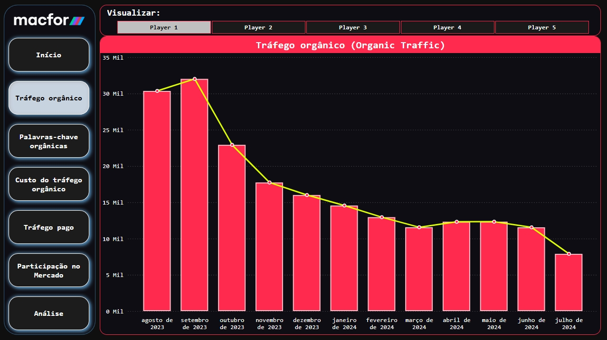
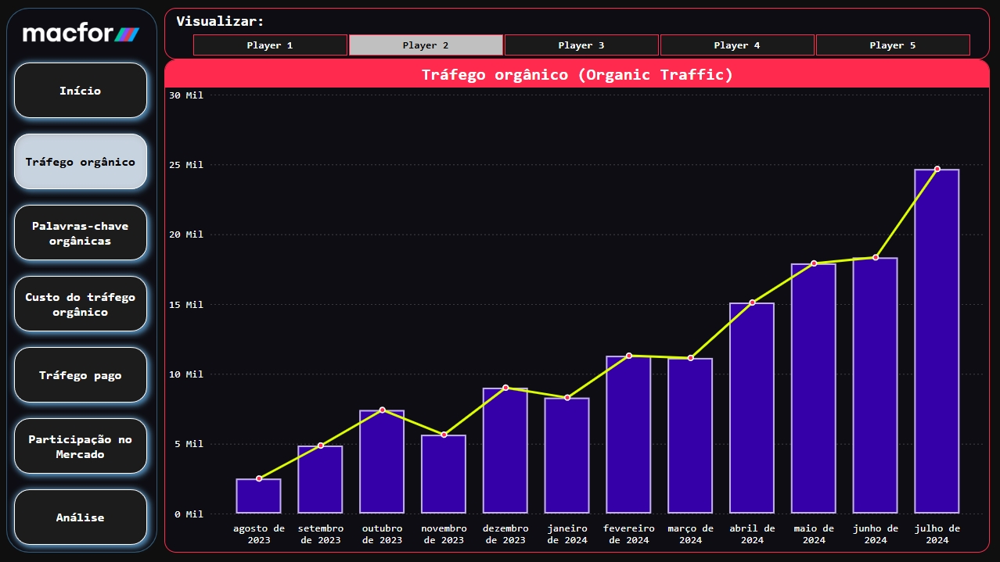
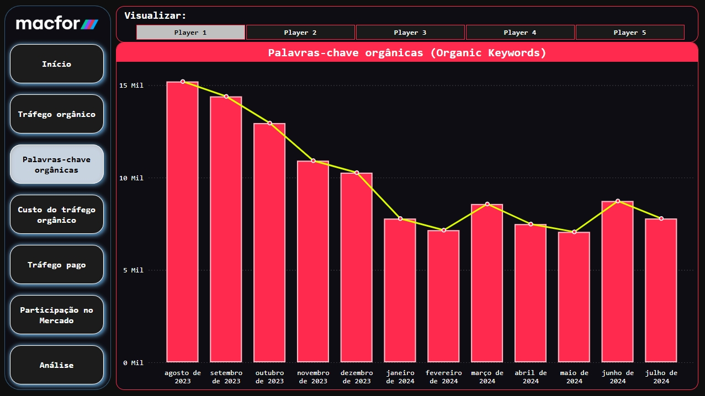
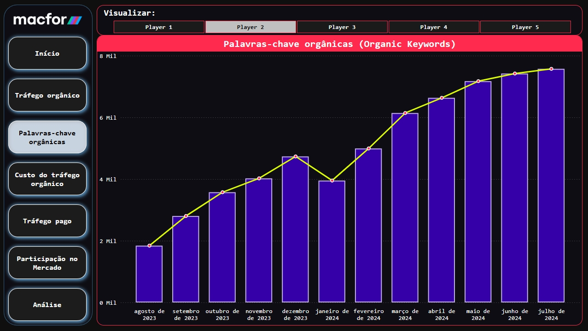
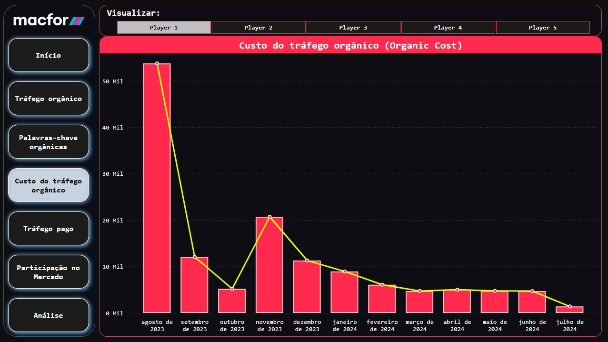
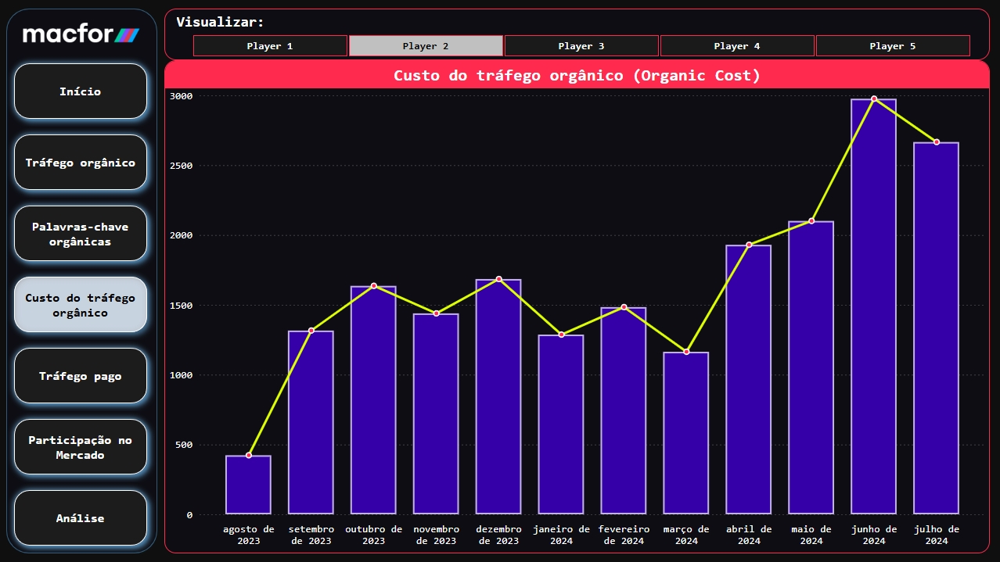
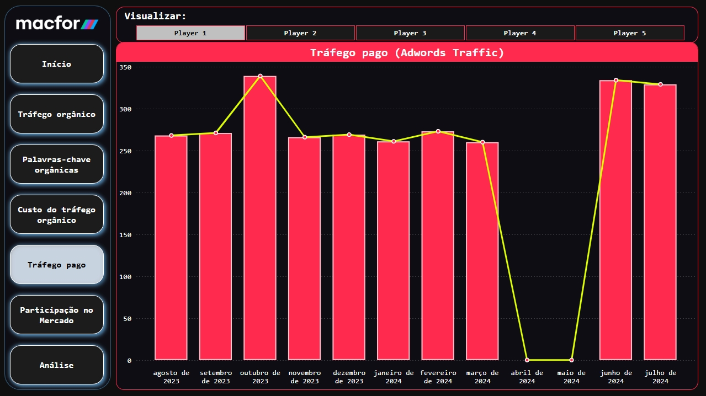
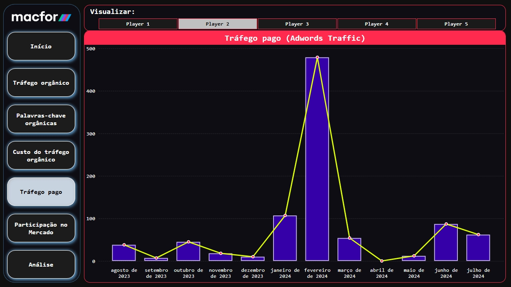
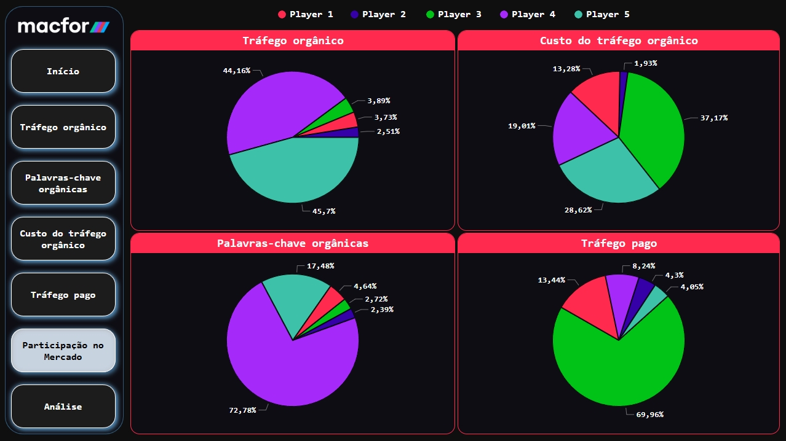
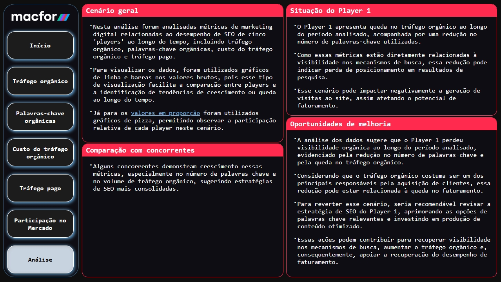

<h1 align="center">📢 Análise de Performance de Marketing: Player 1</h1>

* O objetivo deste projeto foi realizar uma análise da performance do setor de marketing do Player 1, comparando seus resultados com os de seus principais concorrentes. 
* Além da análise comparativa, buscou-se identificar e justificar os fatores responsáveis pela queda de faturamento apresentada pelo Player 1 com base nos dados fornecidos.

## Métricas Analisadas
* A análise foi desenvolvida com foco em indicadores de desempenho do marketing digital, como métricas de:
    - Tráfego orgânico;
    - Quantidade de palavras-chave orgânicas;
    - Custo estimado do tráfego orgânico;
    - Tráfego pago.

## Dashboard
* O dashboard de apresentação foi estruturado em páginas organizadas por métricas específicas do setor de marketing, facilitando a análise segmentada dos indicadores.
* Cada página permite a comparação direta entre o cliente alvo (Player 1) e seus concorrentes.
* A organização das visualizações também possibilita identificar tendências, variações de desempenho e possíveis fatores relacionados à queda de faturamento do Player 1 a partir dos dados analisados.

## Página inicial

## Tráfego Orgânico - Players 1 e 2

## Palavras-chave Orgânicas - Players 1 e 2

## Custo do Tráfego Orgânico - Players 1 e 2

## Tráfego Pago - Players 1 e 2

## Participação no Mercado

## Análise
